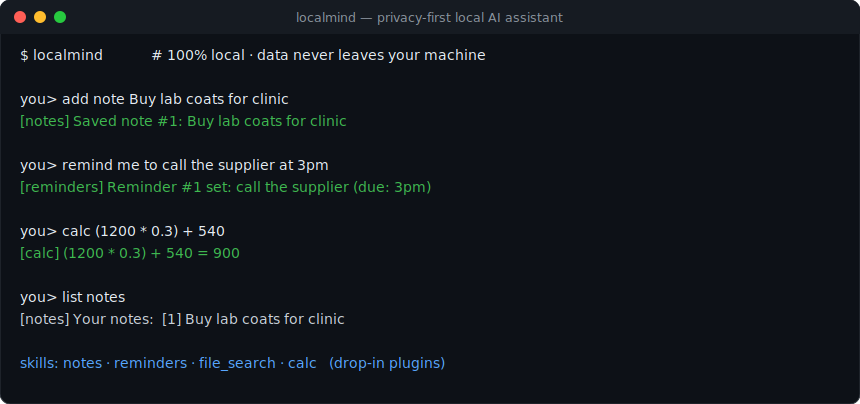
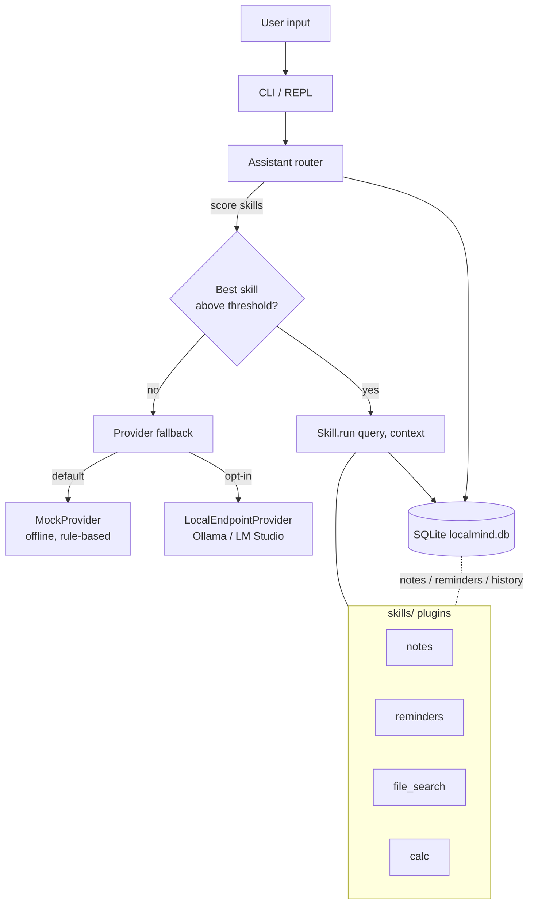

<h1 align="center">🏠 LocalMind</h1>

<p align="center">
  <b>A private AI assistant that runs entirely on your machine.</b><br>
  Plug-in skills (notes, reminders, file search, calc), SQLite memory, and an offline mock model — or point it at Ollama / LM Studio.
</p>

<p align="center">
  <a href="https://github.com/Hayatelin/localmind/releases"></a>
  
  
  
  <a href="https://github.com/Hayatelin/localmind/stargazers"></a>
</p>

<p align="center"></p>

---

LocalMind is a small, dependency-light Python assistant that routes what you type
to drop-in **skills** (notes, reminders, file search, calculator, ...) and only
falls back to a language model when no skill matches. The default language-model
provider is a fully **offline, rule-based "mock" provider**, so LocalMind runs
end-to-end with **no API key and no internet**. When you want smarter free-form
answers, point it at a **local** OpenAI-compatible server such as
[Ollama](https://ollama.com) or [LM Studio](https://lmstudio.ai) — still on your
own machine.

> Not affiliated with any cloud AI service. By default, **nothing ever leaves
> your computer.**

---

## 繁體中文摘要 (Traditional Chinese Summary)

**LocalMind 是一個注重隱私、完全在本機執行的 AI 助理閘道。所有資料都留在你的電腦上。**

- **零設定、可離線執行**：預設使用內建、以規則為基礎的「mock」語言模型，不需要 API 金鑰、不需要網路。
- **技能外掛架構**：把 Python 檔放進 `skills/` 資料夾即可新增功能。LocalMind 會自動把輸入路由到最適合的技能，找不到時才交給語言模型。
- **內建 4 個離線技能**：筆記 (notes)、提醒 (reminders)、檔案搜尋 (file_search)、計算機 (calc)，全部實際可用。
- **本機儲存**：使用 SQLite，將筆記、提醒與對話記憶存在單一 `localmind.db` 檔。
- **可選本機模型**：可指向 Ollama (`http://localhost:11434/v1`) 或 LM Studio (`http://localhost:1234/v1`)，資料一樣不外流。
- **預設絕不連雲端**：隱私是第一原則。

快速開始：

```bash
pip install -e .
python -m localmind --once "add note buy milk"
python -m localmind --once "list notes"
python -m localmind            # 進入互動式對話
```

---

## Why LocalMind?

| Concern | LocalMind's answer |
| --- | --- |
| Privacy | Data is stored only in a local SQLite file. No telemetry, no cloud calls by default. |
| Works offline | The default `mock` provider is rule-based and needs no network. |
| Extensible | Add a `.py` file to `skills/` — no core changes required. |
| Lightweight | Standard library + PyYAML. `requests` is optional and lazily imported. |
| Your hardware, your model | Optional local LLM via Ollama / LM Studio. |

---

## Install

Requires **Python 3.9+**.

```bash
git clone https://github.com/VictorLin/localmind.git
cd localmind

# Recommended: a virtual environment
python -m venv .venv
source .venv/bin/activate        # Windows: .venv\Scripts\activate

# Install LocalMind (editable) + its single runtime dependency (PyYAML)
pip install -e .

# Optional extras:
pip install -e ".[local]"        # adds requests, for the Ollama/LM Studio provider
pip install -e ".[dev]"          # adds pytest for running the test suite
```

You can also just install the dependency directly: `pip install PyYAML`.

---

## Quickstart (copy-paste)

```bash
# Single-shot mode (great for scripts and trying things out):
python -m localmind --once "add note buy milk"
python -m localmind --once "list notes"
python -m localmind --once "remind me to call mom at 5pm"
python -m localmind --once "list reminders"
python -m localmind --once "calc (5 + 3) ** 2"
python -m localmind --once "find report.txt"
python -m localmind --once "hello"        # no skill matches -> offline LLM reply

# Inspect what's loaded and how it's configured:
python -m localmind skills
python -m localmind config

# Interactive chat REPL (Ctrl-D or /quit to leave):
python -m localmind
```

Inside the REPL you can also type `/skills`, `/config` and `/quit`.

Because everything persists to a local SQLite database, a note you add in one
invocation is there the next time you ask to list notes.

---

## Configuration

LocalMind reads config from (highest precedence first): environment variables,
then a YAML file, then built-in defaults. Run `python -m localmind config` to see
the active values and the config file path.

Example `localmind.yaml`:

```yaml
provider: mock                              # "mock" (offline default) or "local"
local_endpoint: http://localhost:11434/v1   # Ollama default; LM Studio uses :1234/v1
local_model: llama3
file_search_dir: /home/you/Documents        # directory the file_search skill scans
# db_path: /custom/path/localmind.db        # optional override
```

Environment variables (override the file):

| Variable | Purpose |
| --- | --- |
| `LOCALMIND_CONFIG` | Path to the YAML config file. |
| `LOCALMIND_HOME` | Base directory for data (db + default config). |
| `LOCALMIND_PROVIDER` | `mock` or `local`. |
| `LOCALMIND_LOCAL_ENDPOINT` | OpenAI-compatible base URL. |
| `LOCALMIND_LOCAL_MODEL` | Model name to request. |
| `LOCALMIND_DB` | Path to the SQLite database. |
| `LOCALMIND_FILE_SEARCH_DIR` | Directory for the file_search skill. |
| `LOCALMIND_SKILLS_DIR` | Extra directory of custom skill modules. |

---

## Pointing LocalMind at Ollama / LM Studio

LocalMind talks to any **local** OpenAI-compatible `/v1/chat/completions` server.

**Ollama:**

```bash
# 1. Install Ollama and pull a model
ollama pull llama3
# Ollama serves an OpenAI-compatible API at http://localhost:11434/v1

# 2. Tell LocalMind to use it
pip install -e ".[local]"        # ensure 'requests' is available
export LOCALMIND_PROVIDER=local
export LOCALMIND_LOCAL_ENDPOINT=http://localhost:11434/v1
export LOCALMIND_LOCAL_MODEL=llama3

python -m localmind --once "what is the capital of France"
```

**LM Studio:** start its local server (default `http://localhost:1234/v1`), then
set `LOCALMIND_LOCAL_ENDPOINT=http://localhost:1234/v1` and
`LOCALMIND_LOCAL_MODEL` to the model you loaded.

Skills always run locally regardless of provider; the provider is only the
fallback for free-form questions. Even with `provider: local`, the server is on
your machine — still no cloud.

---

## How to add a custom skill

A skill is a Python module exposing a module-level `SKILL` object with a `name`,
a list of trigger `keywords`, and a `run(query, context)` function returning a
string.

Create `skills/weather.py` inside the package (or in any folder pointed to by
`LOCALMIND_SKILLS_DIR`):

```python
from localmind.skills import Skill, SkillContext

def run(query: str, context: SkillContext) -> str:
    # context.storage  -> the SQLite Storage object
    # context.config   -> the resolved Config
    return "It's always sunny inside your own machine."

SKILL = Skill(
    name="weather",
    keywords=["weather", "forecast"],
    run=run,
    description="A toy weather skill.",
)
```

Then:

```bash
python -m localmind skills            # confirm it loaded
python -m localmind --once "weather"  # route to it
```

Routing picks the skill with the highest keyword score; a keyword at the start of
your message counts a little extra. If nothing scores high enough, the provider
answers.

---

## Architecture



- **`cli.py`** — argparse CLI: REPL, `--once`, `skills`, `config`.
- **`assistant.py`** — scores skills, routes, records history.
- **`skills/`** — auto-discovered plugins (each exports `SKILL`).
- **`providers.py`** — `MockProvider` (default) and `LocalEndpointProvider`.
- **`storage.py`** — SQLite for notes, reminders and chat history.
- **`config.py`** — layered config (env > YAML > defaults).

---

## Running the tests

```bash
pip install -e ".[dev]"
pytest -q
```

The suite covers skill routing, each skill's core function, and a SQLite
storage roundtrip (including persistence across separate connections).

---

## Privacy stance

- **No cloud by default.** The default provider is fully offline.
- **No telemetry.** LocalMind never phones home.
- **Local storage only.** Everything lives in one SQLite file you control.
- **Opt-in networking.** The only outbound traffic possible is to a *local*
  endpoint you explicitly configure, and `requests` is only imported when used.

---

## License

[MIT](LICENSE) © 2026 VictorLin
